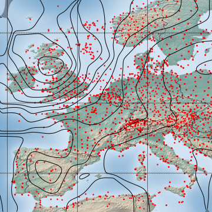

# Fast Barnes Interpolation

This repository provides a Python implementation of the formal algorithms for fast Barnes interpolation as presented in the corresponding [paper published in the GMD journal](https://gmd.copernicus.org/articles/16/1697/2023/gmd-16-1697-2023.pdf).

In addition to Barnes interpolation for 2-dimensional applications, this implementation now also supports Barnes interpolation of 1-dimensional and 3-dimensional data.

&nbsp;

### Mathematical Background

Barnes interpolation is a method that is widely used in geospatial sciences like meteorology to remodel data values $f_k \in \mathbb{R}$ recorded at irregularly distributed points $\mathbf{x}_k \in \mathbb{R}^2$ into a representative analytical field $f(\mathbf{x}) \in \mathbb{R}$.
It is defined as

with Gaussian weights

for a specific Gaussian width parameter $\sigma$.

Naive computation of Barnes interpolation leads to an algorithmic complexity of $\mathcal{O}(N \cdot W \cdot H)$, where $N$ is the number of sample points and $W \times H$ the size of the underlying grid.  
As shown in the paper, for sufficiently large $n$ (in general in the range from 3 to 6) a good approximation of Barnes interpolation with a reduced complexity $\mathcal{O}(N + W \cdot H)$ can be obtained by the convolutional expression

where $\delta_{\mathbf{x}_k}$ is the Dirac impulse function at location $\mathbf{x}_k$ and $r_n(.)$ an elementary rectangular function of a specific length that depends on $\sigma$ and $n$.

&nbsp;

### Example with a Speed-up Factor of more than 1000

The example below is taken from the paper and shows a comparison of the naive Barnes interpolation with the fast Barnes interpolation for $N = 3490$ sample points on a grid with $2400 \times 1200$ points.
The test was conducted on a computer with a customary 2.6 GHz Intel i7-6600U processor with two cores (of minor importance since the code is written in sequential manner).

The recorded execution times for the pure interpolation tasks were
- 280.764 s for the naive Barnes interpolation with a 3-fold nested for-loop over $W$, $H$ and $N$
- &nbsp; &nbsp; 0.247 s for the fast Barnes interpolation with a 4-fold convolution 

The detail views of the isoline visualizations of the respective Barnes interpolation results agree to a very high degree:

 &nbsp; &nbsp; 

The first image depicts the isoline visualization for the naive approach, the second image that for the convolutional, fast approach.

&nbsp;

### Repository Structure

The module `interpolation` implements the Barnes interpolation algorithms using the Euclidean distance metric in $\mathbb{R}$, $\mathbb{R}^2$ or $\mathbb{R}^3$, as described in chapter 4 and 5.4 of the paper.
The Barnes interpolation algorithms that use spherical distance metric on the sphere $\mathcal{S}^2$, as outlined in chapter 5.5, are implemented im module `interpolationS2`.
However, be aware here that the supported geographical domain and projection - as in the paper - is currently fixed to the European latitudes and Lambert conformal projection and cannot be freely chosen.
These algorithms are also available as fast-barnes-py package on PyPI.

The directory `demo` provides Python scripts that reproduce the figures and the tables shown in the paper.
In order to execute them you can follow [these instructions](./doc/ReproduceResults_Doc.md).

&nbsp;

### Further Links

- [Minimal Working Examples](./doc/MinimalWorkingExamples_Doc.md)  
To find out how to use the code.
- [Release Notes](./RELEASE-NOTES.md)  
Summary of the recent changes.

